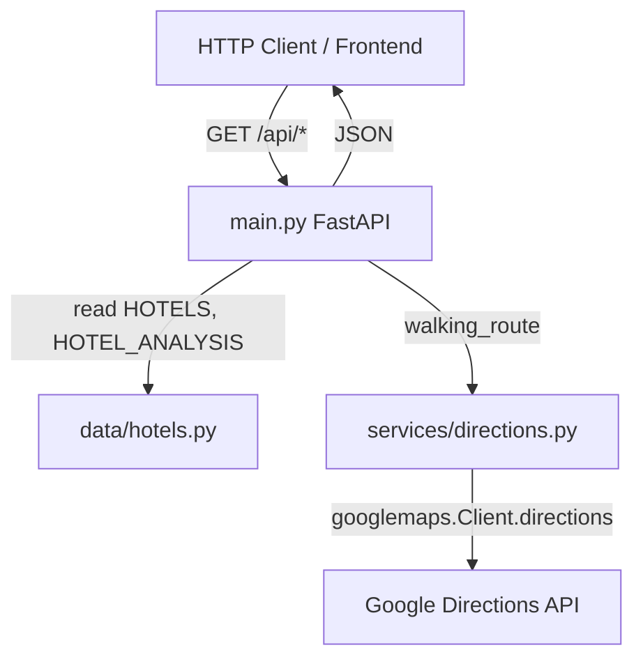

# Backend Architecture Overview

The Disneyland Hotel API is a small **FastAPI** service that serves static hotel metadata and pre-computed travel analysis, plus **live walking routes** from each hotel to Disneyland gates via the **Google Directions API**. The codebase has four Python modules under `backend/`: one application entrypoint, one static dataset, and one external-service wrapper.

---

## Directory layout

```
backend/
├── main.py                 # FastAPI app, routes, Pydantic models, rate limits
├── requirements.txt        # Dependencies
├── data/
│   └── hotels.py           # Static HOTELS, HOTEL_ANALYSIS, DISNEYLAND_GATES
└── services/
    └── directions.py       # Google Maps client + walking_route()
```

There are no routers split into separate files, no database, and no `__init__.py` packages beyond Python’s implicit namespace for `data` and `services` when the app is run with `backend` as the working directory.

---

## High-level architecture



| Layer | Responsibility |
|-------|----------------|
| **`main.py`** | HTTP API, CORS, request logging, SlowAPI rate limits, joins static data into response models |
| **`data/hotels.py`** | Canonical hotel list, addresses, pre-computed walk/transit minutes |
| **`services/directions.py`** | Lazy singleton Google Maps client; walking directions for map display |

**Runtime:** `uvicorn` serves `main:app`. Environment variables load from `.env` at the **repository root** (`load_dotenv(Path(__file__).resolve().parent.parent / ".env")`).

---

## Application bootstrap (`main.py`)

### FastAPI instance

- **Title:** `Disneyland Hotel API`
- **Version:** `1.1.0`
- **Limiter:** `slowapi.Limiter(key_func=get_remote_address)` — limits are keyed by client IP (`X-Forwarded-For` aware via SlowAPI’s remote address helper when behind a proxy).

### Middleware and cross-cutting behavior

1. **Rate limit handler** — `RateLimitExceeded` is handled by SlowAPI’s `_rate_limit_exceeded_handler` (typically HTTP 429).
2. **CORS** — Controlled by `CORS_ORIGINS`:
   - Unset, empty, or `*` → `allow_origins=["*"]`, `allow_credentials=False`
   - Comma-separated list → those origins plus regex for `http(s)://localhost` and `127.0.0.1` with any port
3. **HTTP logging middleware** — Logs method, path, status code, and elapsed milliseconds for every request.
4. **Startup** — Logs sorted list of registered route paths.

### Logging

- Logger name: `disneyland-api`
- Level: `INFO`
- Used for route registration, per-request timing, route lookup warnings, and Google route success/failure.

---

## Data layer (`data/hotels.py`)

### Constants

| Symbol | Value / role |
|--------|----------------|
| `DISNEYLAND_GATES` | `"1313 S Harbor Blvd, Anaheim, CA 92802"` — default destination for walking routes |
| `HOTELS` | 50 hotels: `name`, `address`, `avg_nightly_rate` |
| `HOTEL_ANALYSIS` | 50 rows aligned by hotel name: `nightly_rate`, `walk_mins`, `transit_mins`, `transit_saved_mins` |

`HOTEL_ANALYSIS` documents that walk/transit times were pre-computed for **morning rush transit, May 14 2026 8:00 AM**. These values are **not** recalculated at request time; only the `/api/hotels/route` endpoint calls Google live.

### Dataset relationship

- Every analysis row’s `hotel` string should match a `HOTELS[].name` entry.
- `_build_row()` in `main.py` requires **both** a `HOTELS` match and a `HOTEL_ANALYSIS` match (case-insensitive name). If either is missing, the hotel is treated as unknown.
- `HOTELS[].avg_nightly_rate` is **not** exposed in API responses; search/route responses use `HOTEL_ANALYSIS[].nightly_rate` instead.

---

## Pydantic response models (`main.py`)

### `HotelRow`

Returned by `/api/hotels/search`.

| Field | Type | Source |
|-------|------|--------|
| `hotel` | `str` | `HOTELS.name` |
| `address` | `str` | `HOTELS.address` |
| `nightly_rate` | `int` | `HOTEL_ANALYSIS.nightly_rate` |
| `walk_mins` | `float` | `HOTEL_ANALYSIS.walk_mins` |
| `transit_mins` | `float \| None` | `HOTEL_ANALYSIS.transit_mins` (serialized as JSON `null` when absent in logic — always present in dataset) |
| `transit_saved_mins` | `float` | `HOTEL_ANALYSIS.transit_saved_mins` |

### `HotelRouteResponse`

Returned by `/api/hotels/route` (static hotel name + dynamic route fields from Google).

| Field | Type | Source |
|-------|------|--------|
| `hotel` | `str` | Query parameter (requested name) |
| `origin` | `str` | Google leg `start_address` |
| `destination` | `str` | Google leg `end_address` |
| `distance_text` | `str` | Google leg distance `text` |
| `distance_meters` | `int` | Google leg distance `value` |
| `duration_text` | `str` | Google leg duration `text` |
| `duration_seconds` | `int` | Google leg duration `value` |
| `duration_mins` | `float` | `round(seconds / 60, 1)` in `directions.py` |
| `polyline` | `str` | `overview_polyline.points` for map rendering |

---

## HTTP routes

All routes are defined on the root `app` in `main.py` (no `APIRouter` prefixes beyond the path strings).

| Method | Path | Rate limit | Response | Description |
|--------|------|------------|----------|-------------|
| `GET` | `/api/health` | None | `{"status":"ok","hotels":<count>}` | Liveness; `hotels` = `len(HOTELS)` |
| `GET` | `/api/hotels/names` | None | `list[str]` | All hotel names in dataset order |
| `GET` | `/api/hotels/suggest` | None | `list[str]` | Autocomplete: optional `q`; empty `q` returns all names; else substring match on name (case-insensitive) |
| `GET` | `/api/hotels/search` | **30/minute** per IP | `HotelRow` | Lookup one hotel by name |
| `GET` | `/api/hotels/route` | **10/minute** per IP | `HotelRouteResponse` | Live walking route hotel → gates |

FastAPI also exposes automatic **OpenAPI** docs at `/docs` and `/redoc` (default framework behavior).

### Query parameters

**`/api/hotels/suggest`**

- `q` (optional, default `""`) — partial name filter

**`/api/hotels/search`**

- `q` (required, `min_length=1`) — hotel name or substring
- `exact` (optional, default `false`) — if `true`, require exact name match via `_build_row`; if `false`, substring search via `_search_hotels`

**`/api/hotels/route`**

- `hotel` (required, `min_length=1`) — exact hotel name (resolved via `_build_row`; case-insensitive)

Rate-limited endpoints require `request: Request` in the handler signature so SlowAPI can attach the limiter.

---

## Internal helpers (`main.py`)

### `_build_row(name: str) -> HotelRow | None`

1. Find `HOTELS` entry where `name` matches case-insensitively.
2. Find `HOTEL_ANALYSIS` entry for the same hotel name.
3. If either is missing, return `None`.
4. Otherwise construct `HotelRow`, mapping `transit_mins` explicitly (allows future `None` in data).

### `_search_hotels(query: str) -> list[HotelRow]`

1. Strip and lowercase `query`; empty query returns `[]`.
2. For each `HOTEL_ANALYSIS` row where `query in hotel.lower()`, call `_build_row` and collect non-`None` rows.

---

## Data flow: static dataset → JSON

### Flow A — List / suggest / health (no join logic beyond filtering)

```
HOTELS / HOTEL_ANALYSIS (module import)
        ↓
   Route handler reads lists directly
        ↓
   JSON array or object (FastAPI jsonable_encoder)
```

- **`/api/health`:** `len(HOTELS)` only.
- **`/api/hotels/names`:** `[h["name"] for h in HOTELS]`.
- **`/api/hotels/suggest`:** filter `HOTELS` by substring on `name`.

### Flow B — Hotel search (`HotelRow`)

```
Client: GET /api/hotels/search?q=...
        ↓
   exact=true  → _build_row(q)
   exact=false → _search_hotels(q)
        ↓
   _build_row joins HOTELS + HOTEL_ANALYSIS by hotel name
        ↓
   HotelRow (Pydantic) → JSON
```

**Search outcomes:**

| Condition | HTTP status | Body |
|-----------|-------------|------|
| No match | 404 | `{"detail":"No Disneyland hotel found for '...'"}` |
| Multiple substring matches (`exact=false`) | 400 | `detail` object with `message` and `matches` name list |
| Single match or exact hit | 200 | One `HotelRow` |

### Flow C — Walking route (`HotelRouteResponse`)

```
Client: GET /api/hotels/route?hotel=...
        ↓
   _build_row(hotel) → address (404 if unknown)
        ↓
   walking_route(address)  [default destination: DISNEYLAND_GATES]
        ↓
   services/directions.py → Google Directions API
        ↓
   dict with origin, destination, distance, duration, polyline
        ↓
   HotelRouteResponse(hotel=name, **route) → JSON
```

Note: Pre-computed `walk_mins` in `HOTEL_ANALYSIS` may differ slightly from live `duration_mins` from Google; the route endpoint always reflects **current** Directions results.

---

## Google Directions integration (`services/directions.py`)

### Client lifecycle

- **Library:** `googlemaps` (`googlemaps.Client`)
- **Singleton:** Module-global `_gmaps_client`, created on first `_client()` call
- **API key:** `GOOGLE_MAPS_API_KEY` from environment
- **Invalid key placeholders:** Empty string or literal `your_google_maps_server_api_key_here` → `RuntimeError` with setup instructions

### `walking_route(origin_address, destination=DISNEYLAND_GATES)`

1. Obtain shared client via `_client()`.
2. Call `client.directions(origin, destination, mode="walking")`.
3. Parse first route’s first leg and overview polyline.
4. Return normalized dict (see `HotelRouteResponse` field mapping above).

Only **walking** mode is used. No transit/driving modes are exposed by this API.

---

## Error handling: Google API and routes

Errors are raised in `directions.py` as **`RuntimeError`** with a string message, then translated in `hotel_route()` to **`HTTPException`**.

### In `services/directions.py`

| Situation | Exception | Message pattern |
|-----------|-----------|-----------------|
| Missing/placeholder API key | `RuntimeError` | `GOOGLE_MAPS_API_KEY is not set...` |
| Google HTTP/API failure | `RuntimeError` | `Google Directions API error: {ApiError}` (chained from `googlemaps.exceptions.ApiError`) |
| Empty `results` | `RuntimeError` | `No walking route found for this hotel.` |

`ApiError` from the `googlemaps` library covers HTTP errors, denied requests, quota issues, etc.; the message is forwarded in the `RuntimeError` string.

### In `main.py` `hotel_route()` handler

```python
try:
    route = walking_route(address)
except RuntimeError as exc:
    msg = str(exc)
    if "GOOGLE_MAPS_API_KEY" in msg:
        raise HTTPException(status_code=503, detail=msg)  # Service misconfiguration
    raise HTTPException(status_code=502, detail=msg)      # Upstream / no route
```

| HTTP status | When | Example `detail` |
|-------------|------|------------------|
| **404** | Hotel not in joined dataset | `No Disneyland hotel found for '...'` |
| **503** | Server not configured for Google | Message contains `GOOGLE_MAPS_API_KEY` |
| **502** | Google error or no route | `Google Directions API error: ...` or `No walking route found...` |

Warnings are logged for 404 hotel names and any route failure before the HTTP response is returned. Successful routes log duration and distance text.

**Not caught:** Exceptions other than `RuntimeError` from `walking_route` (e.g. unexpected KeyError parsing Google JSON) would propagate as FastAPI **500** unless a global handler exists (none is defined).

---

## Rate limiting (SlowAPI)

| Endpoint | Limit | Key |
|----------|-------|-----|
| `/api/hotels/search` | 30 requests / minute | Client IP (`get_remote_address`) |
| `/api/hotels/route` | 10 requests / minute | Client IP |

Implementation:

- `@limiter.limit("...")` decorator on handlers
- `app.state.limiter = limiter`
- `app.add_exception_handler(RateLimitExceeded, _rate_limit_exceeded_handler)`

Exceeded limits return SlowAPI’s standard rate-limit response (typically **429 Too Many Requests**). Health, names, and suggest endpoints are **unlimited**.

---

## Dependencies (`requirements.txt`)

| Package | Role |
|---------|------|
| `fastapi` | Web framework |
| `uvicorn[standard]` | ASGI server |
| `python-dotenv` | Load `.env` at startup |
| `googlemaps` | Google Directions client |
| `slowapi` | IP-based rate limiting |

Pydantic v2 models are used via FastAPI’s bundled Pydantic integration (`BaseModel`, `response_model=...`).

---

## Environment variables

| Variable | Used by | Purpose |
|----------|---------|---------|
| `GOOGLE_MAPS_API_KEY` | `directions.py` | Server-side Directions API |
| `CORS_ORIGINS` | `main.py` | Comma-separated allowed origins, or `*` / empty for wide open |

---

## Summary

The backend is intentionally minimal: **static analysis data** lives in `hotels.py` and powers search and comparison UIs; **one live integration** fetches walking polylines and timings for maps. Request handling centers on `main.py`, which joins two in-memory lists for rich hotel rows, applies substring or exact matching rules with explicit 400/404 behavior, and delegates routing to Google with a clear **503 vs 502** split for configuration versus upstream failures. Rate limits protect the search and route endpoints that are most expensive or abuse-prone, while lightweight list endpoints remain open.
