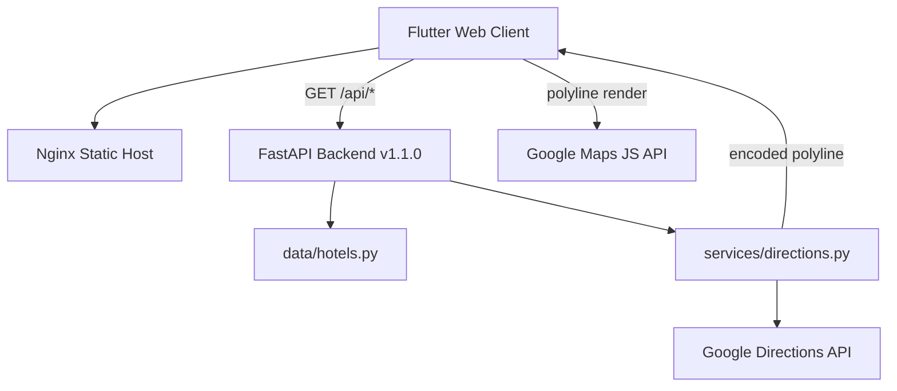

# UCLA-CEE-180-x-Disneyland-Project


## About

UCLA CEE 180 x Disneyland Project is a hotel comparison application for Disneyland visitors. It indexes **50** Anaheim-area hotels with pre-computed walk and transit times, nightly rates, and live walking routes to park gates, helping travelers evaluate cost, commute time, and parking ($40/night modeled).

## System Architecture



## Key Features & Metrics

- **50-hotel static dataset** — `HOTELS` + `HOTEL_ANALYSIS` joined at request time; walk/transit pre-computed for **May 14 2026, 8:00 AM** rush window.
- **Dual-rate-limit protection** — `/api/hotels/search` at **30 req/min/IP**; `/api/hotels/route` at **10 req/min/IP** via SlowAPI.
- **Side-by-side compare** — Flutter UI caps comparison at **2 hotels**; filters include budget (**≤$175**/night) and walk-friendly (**≤15 min** walk).
- **Per-request latency logging** — HTTP middleware logs method, path, status, and elapsed **ms** via `time.perf_counter()`.

## Technical Implementation Notes

- **Hybrid static/live routing** — search uses in-memory analysis; `/api/hotels/route` calls Google Directions walking mode live, so `walk_mins` in dataset may diverge from live `duration_mins`.
- **CORS split behavior** — unset/`CORS_ORIGINS=*` allows all origins with `allow_credentials=False`; explicit list adds localhost regex fallback.
- **Google key separation** — server uses `GOOGLE_MAPS_API_KEY` (Directions); browser uses `GOOGLE_MAPS_JS_API_KEY` via `--dart-define` at build time.
- **Platform-view map bridge** — `hotel_route_map_web.dart` registers a `platformViewRegistry` factory and invokes JS to render encoded polylines from the backend.
- **503 vs 502 routing errors** — missing API key → **503**; upstream Google failure → **502**.

## Local Deployment

Backend:

```bash
cd backend
pip install -r requirements.txt
# Create ../.env with GOOGLE_MAPS_API_KEY=your_key
uvicorn main:app --reload --host 127.0.0.1 --port 8000
```

Frontend:

```bash
cd frontend
flutter pub get
flutter run -d chrome \
  --dart-define=API_BASE_URL=http://localhost:8000 \
  --dart-define=GOOGLE_MAPS_JS_API_KEY=your_js_key
```

## Project Structure

```
UCLA-CEE-180-x-Disneyland-Project/
├── .do/app.yaml             # DigitalOcean App Platform spec
├── backend/
│   ├── main.py              # FastAPI routes, CORS, rate limits
│   ├── data/hotels.py       # 50 hotels + analysis constants
│   ├── services/directions.py
│   ├── Dockerfile
│   └── requirements.txt
└── frontend/
    ├── lib/
    │   ├── main.dart        # Search, compare, sidebar filters
    │   ├── services/api.dart
    │   ├── widgets/hotel_route_map_web.dart
    │   └── config.dart      # dart-define API/Maps keys
    ├── Dockerfile           # Multi-stage Flutter → nginx
    └── pubspec.yaml
```
